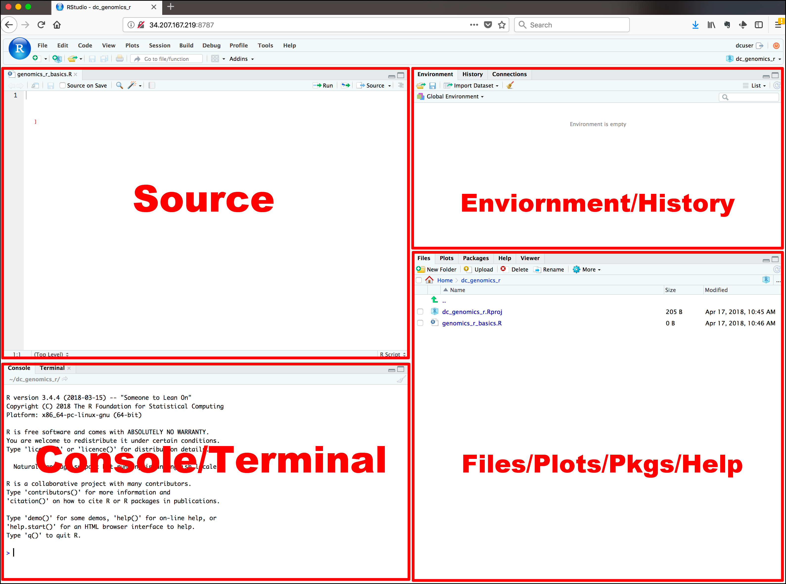

# Introduction à R et RStudio

## Qu'est-ce que R et Rstudio 

**R** est un langage de programmation dédié à la manipulation, l’analyse statistique et la visualisation de données.Développé au début des années 1990 par Ross Ihaka et Robert Gentleman afin d'enseigner l'introduction aux statistiques, le langage R possède aujourd'hui une impressionnante communauté d'utilisateurs et développeurs qui créent et partagent des milliers de package via le Comprehensive R Archive Network (CRAN).

R est de plus en plus utilisé dans plusieurs domaines scientifiques nécessitant le traitement de larges jeux de données pour plusieurs raisons, dont notamment : 

- gratuit et open source ;
- multiplateformes (Windows, Mac et Linux) ;
- possède d'excellentes capacités graphiques (idéal pour les figures d'articles scientifiques) ; 
- facile de développer fonctions (automatisation) ; 
- possède une très grande communauté d'utilisateurs et de développeurs (beaucoup de librairies, aide, etc.).

**RStudio** est, quant à lui, un environnement de développement intégré (*Integrated Development Environment*, IDE) qui permet de programmer non seulement avec R mais aussi avec d'autres langages de programmation comme Bash et Python. En programmation informatique, un IDE est un logiciel de création d'applications qui rassemble des outils de développement fréquemment utilisés dans une seule <span style="text-decoration:underline">interface utilisateur graphique</span> (*Graphical User Interface*, GUI). L'interface graphique conviviale d'un IDE facilite l’écriture de scripts et l’usage de R au quotidien.

**Plus en détails techniques, voici "l'histoire évolutive" d'un système de base (console R), vers l'utilisation de scripts et ultimement le recours à un IDE :**   

R est un langage de programmation interprété. Concrètement, cela signifie que l’on écrit des commandes que le logiciel R exécute immédiatement, une par une, dans une console (un peu comme lorsqu’on entre des calculs dans une calculatrice). Cependant, entrer les commandes directement dans la console présente certains inconvénients : les analyses sont plus difficiles à automatiser et les étapes réalisées ne laissent pas toujours de trace écrite, ce qui rend la reproduction des analyses plus compliquée (peu reproductible). 

Le niveau "supérieur" d'utilisation consiste à regrouper une serie prédéterminée de commandes ensemble et de les enregistrer dans un fichier texteé. Ce fichier peut ensuite être envoyé au logiciel R, qui exécutera les commandes une par une, exactement comme si un utilisateur les avait entrées manuellement dans la console. Un fichier texte contenant des commandes d’un langage de programmation destinées à être exécutées s’appelle un **script**. Une façon assez simple de programmer consisterait donc à ouvrir un éditeur de texte (par exemple Notepad), écrire les commandes R, enregistrer le fichier et demander au logiciel R d’exécuter ce script. Toutefois, écrire le code dans un logiciel et l’exécuter dans un autre devient rapidement peu pratique. Pour faciliter ce travail, on peut utiliser un **environnement de développement intégré (IDE)**, qui permet d’écrire, organiser et exécuter le code au même endroit.

Dans sa forme la plus basique, ce dernier consiste en une seule application combinant un éditeur de texte avec un terminal, pour faciliter l'envoie de commandes de l'un vers l'autre. De nos jours, les IDEs possèdent de nombreux autres outils pour aider au dévelopement de code : un débogueur, un explorateur de fichiers, un résumé des variables... Même si certains IDEs sont specialisés pour un langage de programmation (comme R Studio avec R et [Spyder](https://www.spyder-ide.org/) avec [Python](https://www.python.org/)), un IDE est une application séparée et indépendante du langage de programmation et il est possible d'utiliser n'importe lequel; il s'agit après tout d'un simple éditeur de texte. Certains IDEs comme le très populaire gratuit et open-source [VSCode](https://code.visualstudio.com/) ont la prétention de pouvoir être utiliser avec n'importe quel langage.

```{r echo=FALSE, out.width = "100%", fig.align = "center", out.lenght = "100%"}
knitr::include_graphics("data/programming-evolution.png")
```

## Composants de RStudio

```{r echo=FALSE, out.width = "100%", fig.align = "center", out.lenght = "100%"}

```

L'interface RStudio inclut : 

- un **éditeur de code** (Source),
- une **console** (Console) et **terminal** (Terminal),
- un **gestionnaire de fichier** (Files),
- une **sortie graphique** (Plots),
- le **gestionnaire de paquets** (Pkgs),
- une **aide en ligne** (Help),
- le contenu de l'**espace de travail** (Environment),
- l'**historique** (History). 

Nous n'allons pas entrer dans les détails de chacun des composants mais voici les plus utiles :

**Source** 

L'éditeur de code de RStudio est l'endroit où les scripts sont rédigés. Une variété de fonctionnalités facilite la rédaction par notamment la mise en évidence d'erreur de syntaxe, l'auto-complétion, la recherche et remplacement de mots, etc. RStudio permet aussi d'exécuter de manière flexible le code R directement depuis l'éditeur de source.

Nous abordons plus en détails la rédaction de scripts dans la section [Utiliser RStudio et R Mardown]

**Console**

La console est le cheval de bataille de R où le code rédigé est exécuté. Vous pouvez directement écrire votre code dans la console cependant le code qui y est écrit ne sera rédigé dans votre script. 

**Files** 

L'onglet files correspondant à l'outils `Finder` pour les utilisateurs de Mac et `File explorer` pour Windows. Il permet à l'utilisateur de naviguer à travers les dossiers sur son ordinateur. L'utilisateur peut aussi y créer de nouveaux dossiers et renommer ou supprimer des dossiers et documents. On peut aussi y définir un dossier comme répertoire de travail (`Files` -> `More` -> `Set As Working Directory`).

**Environment**

Un des concepts de base en programmation est la variable/objet. Une variable vous permet de stocker une valeur (par exemple 4) ou un objet (par exemple un tableau de données ou une fonction) à l’aide de l’opérateur d’assignation `<-` ou `=`. Vous pouvez ensuite utiliser le nom de cette variable pour accéder facilement à la valeur ou à l'objet stocké dans cette variable. L'ensemble des objets stockés se retrouve dans l'onglet Environment de RStudio.
