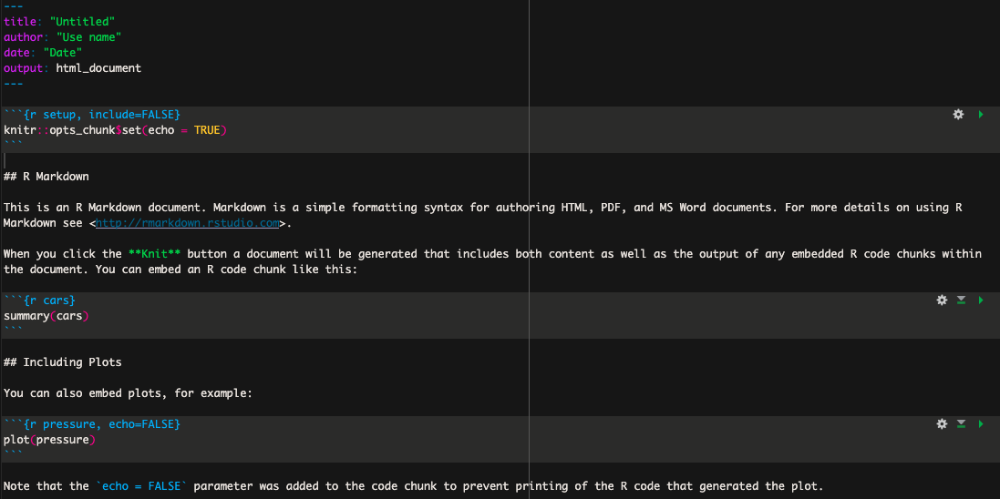

# Utiliser RStudio et R Mardown

## Pourquoi utiliser R Markdown

Plusieurs préfèrent rédiger leurs scripts dans des fichiers de type R Markdown plutôt que R Script pour diverses raisons. Je recommande personnellement d'utiliser R Markdown pour les raisons suivantes : 

- Ce type de fichier permet de facilement annoter son script entre les sections de codes qui sont comprises dans un bloc ("chunk" en anglais).

  - Un script bien annoter permet non seulement au scripteur de s'y retrouver facilement mais aussi de partager son code à ses collègues ou même publiquement. 
  
  - En effet, il est de plus en plus commun de retrouver dans les articles scientifiques un lien vers les scripts générés et utilisés par les auteurs de l'article afin d'analyser leurs données. 

- Mais aussi, les blocs de codes permettent d'exécuter seulement certaines sections de code à la fois, ce qui ultimement permet de modifier puis exécuter seulement ces sections de code sans avoir à re-exécuter l'entièreté du script. 

## Utliser R Markdowm

La première étape consiste donc à créer un nouveau document de type R Mardown. Pour cela, ouvrez RStudio, puis cliquez sur `Fichier`. Dans le menu déroulant sélectionner `Nouveau Fichier` puis `R Markdown...`. 

Dans la nouvelle fenêtre vous pouvez donner le titre que vous voulez à votre nouveau document. 
Par défault le nouveau document affiche une petite introduction ainsi que des exemples tel que sur l'image ci-dessous : 

```{r echo=FALSE, out.width = "100%", fig.align = "center", out.lenght = "100%"}

```

Ces informations ne sont pas pertinentes et vous pouvez supprimer l'ensemble du texte sous l'entête (l'entête correspond à la section délimitée par les trois tirets `---`).

### Bloc de codes 

Dans R markdown, les lignes de codes à exécuter doivent être comprises dans un bloc de code. Le texte non compris dans un bloc n'est donc pas considéré comme du code, ce qui permet d'annoter minutieusement votre script entre les blocs afin de vous y retrouver facilement. 

Un bloc de code R doit toujours débuter avec les caractères suivants : ` ```{r}` 
et se terminer avec les caractères suivant : ` ``` `. Un bloc de code ressemble donc à ceci : 

````{verbatim, lang = "python"}
```{r}

``` 
```` 

Un bloc de code peut être inséré avec l'une des façons suivantes : 

- le raccourcit clavier : `Ctrl` + `Alt` + `I` 
- inscrire manuellement les caractères délimitant (` ```{r} `  ` ``` ` )
- l'onglet `Code` puis `Insert chunk` 
- le bouton vert avec le petit c et signe de plus en haut à droite.

Un fois votre code rédigé dans le bloc, vous pouvez exécuter l'entièreté du code contenu dans ce block en appuyant sur le bouton vert en haut à droite du code (<font color='green'> ▶ </font>). 

Il est possible d'insérer des blocs de code de différents langages de programmation tels que Bash et Python, il suffit de remplacer le `r` entre les accolades par le nom du programme utilisé. 

Plusieurs autres options peuvent être appliqués sur les blocs, pour plus d'informations je vous recommande de consulter la documentation disponible sur internet. 

### Définir le répertoire de travail par défaut 

Généralement, avant de commencer à analyser des données, il faut indiquer à R où se trouve les données sur notre ordinateur. Il existe plusieurs manières de procéder, dont notamment, spécifier au début du script un répertoire/dossier de travail par défaut. Pour ce faire, une suffit d'utiliser la commande `setwd()` comme présenté sur l'exemple ci-dessous. Le texte entre les guillemets de l'exemple doit simplement être modifié pour le vrai chemin vers votre répertoire/dossier de travail. Une fois le répertoire de travail définit par défaut de la sorte il n'est pas nécessaire d'inclure le chemin vers les fichiers que l'on veut importer tant qu'il se trouve dans le répertoire spécifié. Cela s'applique aussi à la sauvegarde de tableaux, figures ou autres. 

````{verbatim, lang = "python"}
```{r} 
setwd("/chemin/vers/le/répertoire/")
```
```` 

La fonction `getwd()` affiche quant à elle le répertoire de travail. 

### Importer des données

Pour importer un fichier en format *comma seperated value* (csv) dans R on utilise la commande `read.csv` avec les arguments suivants : 

- `file` : Spécifier le nom du fichier 
- `header` : Indiquer si la première ligne de notre tableau correspond au nom des colonnes (valeurs possible TRUE/FALSE)
- `row.names` : Indiquer quelle colonne de notre tableau correspond au nom des rangés 
- `sep` : Indiquer quel caractère doit servir de séparateur pour les colonnes 
- `check.name` : Ne pas systématiquement remplacer le trait d'union par un point (valeurs possible TRUE/FALSE)

````{verbatim, lang = "python"}
 ```{r}
df = read.csv(file = "nom_fichier.csv", header = TRUE, row.names = 1, sep = ",", check.names = FALSE)  
```
```` 
Pour un tableau en format *tab delimited* (souvent avec l'extension .tsv) on peut utiliser la fonction `read.table` et spécifier `\t` comme séparateur. 

### Manipulation de variables et types de données

```{r, eval = FALSE}
val1 = 5       # attribuer la valeur d'un nombre entier
val2 = 3.2     # attribuer la valeur d'un nombre décimal
message = "Hello world" # attribuer une valeur non numérique sous forme de caractères

print(val1)  # Affiche la valeur de val1
class(message)  # indique le type variable 

# Puisque nos variable val1 et val2, nous pouvons les utiliser dans des équations mathématiques
produit_v1v2 = val1 * val2
produit_v1v2
```


### Structures des données

**Vecteurs**

Un vecteur est une structure de base qui contient plusieurs valeurs **d'un même type**.

```{r, eval = FALSE}
vec = c(1, 2, 3, 4, 5)  # Création d'un vecteur
print(vec)  # Afficher le vecteur
length(vec)  # Longueur du vecteur / combien d'éléments il contient 
sum(vec)  # Somme des éléments (seulement si les éléments sont numériques)
mean(vec)  # Moyenne des éléments (seulement si les éléments sont numériques)
sd(vec)  # Écart-type des éléments (seulement si les éléments sont numériques)
```

**Listes**

Une liste peut contenir des éléments de **types différents**.

```{r, eval = FALSE}
# Création d'une liste
lst = list(Name = "Marie Curie", 
           Born = 1867, 
           Nobels_prizes = c("Physics", "Chemistry"), 
           Nobels_year = c(1903, 1911))  

print(lst)  # # Afficher la liste
lst$Nobels_prizes  # Accès à un élément de la liste
```

**Matrices**

Une matrice est un tableau diposé en *m* rangées et *n* colonnes qui contient des valeurs **d'un même type** (généralement numérique et optimisées pour les calculs mathématiques). 

```{r, eval = FALSE}
mat = matrix(1:9, nrow=3)  # Création d'une matrice 3x3
print(mat)  # Afficher le tableau
```

**Tableaux de données / data frames**

Les tableaux de données peuvent être hétérogènes et sont utiles pour le stockage de données. 

```{r, eval = FALSE}
df = data.frame(Name = c("Marie Curie", "Lise Meitner", "Barbara McClintock"), 
                Born = c(1867, 1878, 1902),
                Nobels = c("Physics - Chemistry", NA, "Physiology or Medicine"))

print(df)  # Afficher le tableau
```

### Exploration de données

R comprend plusieurs jeux de données qui sont souvent utilisés comme exemple afin de démontrer les fonctions de R ([liste complète](https://stat.ethz.ch/R-manual/R-devel/library/datasets/html/00Index.html)). Aujourd'hui nous utiliserons le jeu de données `penguins_raw` qui comprend différentes données (longueur des nageoires, masse corporelle, dimensions du bec et sexe) de trois espèces de manchots retrouvés sur les trois Îles de l'archipel Palmer en Antarctique. 

```{r, eval = FALSE}
df_manchot = penguins_raw
head(df_manchot)  # Affiche les premières lignes
tail(df_manchot)  # Affiche les dernières lignes
summary(df_manchot)  # Statistiques descriptives
str(df_manchot)  # Structure des données
```

**Sélection de colonnes et utilisation de filtres** 

```{r, eval = FALSE}
df_manchot$Island  # Sélectionner la colonne Island 
unique(df_manchot$Island) # Affiche les valeurs unique présente dans la colonne Island 
# Garder uniquement les manchots de l'ile Dream
df_manchot_dream = subset(df_manchot, Island == "Dream") 
# Garder uniquement les petits manchots 
df_manchot_petit = subset(df_manchot, `Body Mass (g)` < 3000)
# Utiliser plusieurs conditions pour garder uniquement les petits manchots de l'île Dream 
df_dream_petit = subset(df_manchot, Island == "Dream" & `Body Mass (g)` < 3000) 
```

**Combiner des tableaux de données**

Lorsque nous avons plusieurs jeux de données contenant des informations complémentaires, nous pouvons les combiner avec la fonction `merge()`.

```{r, eval = FALSE}
df_info_gen = data.frame(Name = c("Marie Curie", "Lise Meitner", "Barbara McClintock"), 
                         Born = c(1867, 1878, 1902),
                         Nobels = c("Physics - Chemistry", NA, "Physiology or Medicine"))

df_info_educ = data.frame(Name = c("Marie Curie", "Lise Meitner", "Barbara McClintock"), 
                          Study = c("Physics - Chemistry", "Nuclear physics", "Cytogenetics"), 
                          Institutions = c("University of Paris", "University of Vienna", "University of Missouri"))

# Fusionner les deux tables sur la colonne "ID"
df_info_all = merge(df_info_gen, df_info_educ, by = "Name", all = TRUE)
```

Explication :

- `by = "ID"` : Spécifie que la fusion se fait sur la colonne `Name` présente dans les deux jeux de données.  
- `all = TRUE` : Effectue une jointure externe (`outer join`), conservant toutes les lignes des deux data frames, même si elles ne correspondent pas parfaitement. Si `all = FALSE` (par défaut), seuls les ID présents dans les deux tables sont conservés (`inner join`). `all.x = TRUE` conserverait toutes les lignes de `df_info_gen`, et `all.y = TRUE` celles de `df_info_educ`(jointure gauche/droite).  
  
**Visualisation avec ggplot2** 

```{r, eval = FALSE}
install.packages("ggplot2")  # Installer ggplot2 si nécessaire
library(ggplot2)  # Charger la bibliothèque

# Pour comparer la masse corporelle (Body Mass (g)) en fonction des espèces on peu générer un boxplot (boîtes à moustaches)

graph_bmi_species = ggplot(data = df_manchot, aes(x = Species, y = `Body Mass (g)`)) + 
  geom_boxplot(alpha = 0.3, outlier.shape = NA) +
  geom_jitter(size = 3) + # Rajouter des points pour voir la distribution des valeurs 
  labs(title = "Body Mass (g) per species", x = "Species", y = "Body Mass (g)") +  # Titres
  theme_minimal()  # Application d'un thème minimaliste

# Relation entre la masse corporelle (Body Mass (g)) et la longueur de la nageoire (Flipper Length (mm)) 
graph_bmi_flipp = ggplot(data = df_manchot, aes(x = `Flipper Length (mm)`, y = `Body Mass (g)`)) +  
  geom_point(color = "lightblue", size = 3) +  # Ajout de points en bleu
  geom_smooth(method = "lm", se = FALSE, color = "orange") +  # Ajout d'une droite de régression
  labs(title = "Relation entre la masse corporelle (g) et la longueur de la nageoire (mm)", 
       x = "Masse corporelle (g)", y = "Longueur de la nageoire (mm)") +  # Titres
  theme_minimal()  # Application d'un thème minimaliste

```

**Exporter des données**

```{r, eval = FALSE}
# Exporte un tableau de données 
write.csv(x = df_info_all, file = "data_womenscience.csv", row.names = FALSE)  # Sauvegarde du data frame sous format CSV
# Exporter les graphique en PDF (vectoriel)
ggsave(filename = "graph_bmi_flipp.pdf", plot = graph_bmi_flipp, width = 8.5, height = 4, units = "in")
# Exporter les graphique en SVG pour l'insérer dans word (vectoriel)
ggsave(filename = "graph_bmi_flipp.svg", plot = graph_bmi_flipp, width = 8.5, height = 4, units = "in")
```


