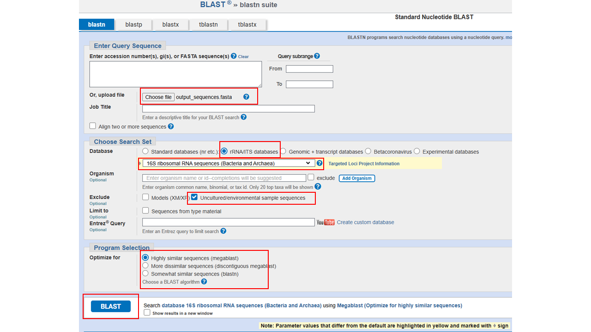

# Vos ASVs et BLAST

## Vos ASVs

Vous avez vue en classe une figure représentant l'abondance relative des principaux genres bactériens présents sous la langue ainsi que sur la paume de la main dominante de chacun des scientifiques de votre classe. Vous aimeriez maintenant générer une figure similaire à celle présentée en classe mais comprenant uniquement vos échantillons et incluant l'ASV. Pour ce faire, vous devrez utiliser vos nouvelles connaissances des différentes fonctions R! 


Commencez par créer un nouveau document de type R markdown oũ vous pouvez votre script avec ces commandes qui installerons puis chargerons les librairies que vous devriez avoir à utiliser et chargerons le tableau de données. 

```{r, eval=FALSE}
# Installer les librairies 
install.packages("devtools")
install.packages("randomcoloR")
install.packages("ggplot2")
install.packages("dplyr")
install.packages("forcats")

# Charger les librairies 
library(randomcoloR)
library(ggplot2)
library(dplyr)
library(forcats)
library(devtools)
install_github("helixcn/seqRFLP")
library("seqRFLP")

# Charger le tableau de données 
df_raw = read.csv("https://raw.githubusercontent.com/karinevilleneuve/BIO1410-2026/refs/heads/main/data/bio1410_2026_ADN.csv", header = TRUE)
```


Maintenant que vous avez importé le tableau de données, vous devez utiliser R pour réaliser chacune de des étapes suivantes. Pour vous aide5 vous pouvez utiliser l'intelligence artificielle, questionner vos démonstratrices, revoir les fonctions présentées précédemment, analyser le code des sections suivante, etc. Ci-dessous vous trouverez une des solutions possibles pour compléter chacune des étapes dans un block caché, simplement appuyer sur **▶ Code ** pour le révéler. Il y a plus d'une façon d'arriver à un même résultat alors n'hésitez pas à essayer et comparer diverses méthodes. 

1. Filtrer le tableau de données pour conserver uniquement les séquences appartenant à votre scientifique. 

2. Puisque nous voulons illustrer uniquement les 10 genres bactériens les plus abondant, il faut, pour chaque région, grouper ensemble les ASVs appartenant à un même genre et additionner leur valeur d'abondance. Les valeurs obtenues doivent ensuite être transformées en abondance relative. Finalement, les genres bactériens qui ne font pas partie des 10 genres les plus abondants doivent être regroupés sous la catégorie "Autres". 

3. Générer le graphique. 


**Étape 1. Filtrer le tableau de données** 

```{r, eval = FALSE, class.source="fold-hide"}
#### ---- Code  ---- ####

unique(df_raw$Scientifique) # (1)
df_sub = subset(df_raw, Scientifique == "Leone Norwood Farrell") # (2) 

#### ---- explication  ---- ####

# (1) Afficher les différentes options de noms de scientifique 
# (2) Filtrer le tableau de données en inscrivant entre les guillemets le nom de la scientifique qui vous a été assignée 
```

**Étape 2. Grouper et calculer l'abondance relative**

```{r, eval = FALSE, class.source="fold-hide"}
#### ---- Code  ---- ####

df_abond_rel = df_sub %>% 
  filter(Abundance > 0) %>% # (1)
  group_by(Region) %>% # (2)
  mutate(Abondance_relat = Abundance / sum(Abundance)) %>% # (3) 
  ungroup()

valider = df_abond_rel %>% # (4) 
  group_by(Region) %>%
  summarise(Total = sum(Abondance_relat)) 

#### ---- explication  ---- ####

# (1) Puisqu'il est impossible de diviser 0, nous retirons les ASVs qui ont une abondance de 0 

# (2) Pour réaliser les opérations mathématiquement séparément pour chaque région nous 
#     utilisons la fonction group_by() pour indiquer à R dans quelle colonne se trouve nos catégories (régions)
#     qu'il doit traiter séparément.

# (3) Pour obtenir l'abondance relative nous créons une nouvelle colonne "Abondance_relat" qui est 
#     le résultats de Abundance / sum(Abundance)

# (4) Nous validons que la somme est bien de 1 pour chacune des régions 

```

**Étape 3.Générer la figure**

```{r, eval = FALSE, class.source="fold-hide"}
#### ---- Code  ---- ####

df_top = df_abond_rel %>% 
  group_by(Region) %>%
  arrange(Region, desc(Abondance_relat)) %>% # (1)
  mutate(Order = row_number()) %>% # (2)
  mutate(Taxonomie = ifelse(Order < 11, paste(Phylum, Genus, OTU, sep = "; "), "Autres")) %>% # (3)
  group_by(Region, Taxonomie) %>% # (4) 
  summarise(Abondance_relative = sum(Abondance_relat)) # (4) 

#### ---- explication  ---- ####

# (1) Trier nos données par région puis en fonction de l'abondance relative 
# (2) Pour chaque région, associer un numéro de 1 à x dans la nouvelle colonne "Order" (1 étant le taxon le plus abondant)
# (3) Générer une nouvelle colonne "Taxonomie" et pour remplir cette colonne ; 
#           si la valeur de Order est < 10, on combine la valeur de la colonne Phylum avec celle de la colonne Genus ; 
#           si la valeur > 10 on assigne "Autres" 
# (4) Finalement, nous voulons regrouper les taxons "Autres" ensemble 
#     alors nous reproduisons les étapes de groupement et addition réalisées précédemment (2.4)

# Créer une palette de couleur unique 
nbr_unique_tax = length(unique(df_top$Taxonomie)) # Compter le nombre de taxons uniques (~ 20)
custom_colors = distinctColorPalette(k = nbr_unique_tax) # Générer une palette de 20 couleurs différentes 
color_names = unique(df_top$Taxonomie) # Associer le nom de nos bactéries à chacune des couleurs 
my_palette = setNames(custom_colors, color_names) # Combiner les couleurs avec le nom des taxons
my_palette[["Autres"]] = "lightgrey" # Associer une valeur gris pâle au groupe "Autres" 

# Utiliser la fonction fct_relevel pour que le groupe "Autres" figure en premier dans la légende 
df_top$Taxonomie = fct_relevel(df_top$Taxonomie, "Autres")

graph = ggplot(df_top, aes(x = Region, y = Abondance_relative, fill = Taxonomie)) + 
  geom_bar(position="stack", stat="identity") +
  xlab("Région") + 
  ylab("Abondance relative") + 
  theme_minimal() +
  scale_fill_manual(values = my_palette) + 
  scale_y_continuous(expand = c(0,0), limits = c(0,1)) + 
  scale_x_discrete(expand = c(0,0)) + 
  guides(fill = guide_legend(nrow = 10)) # Spécifier que nous voulons 10 lignes max pour la légendre 

# Enregistrer la figure 
ggsave(graph, filename = "abondance_relative.pdf", width = 8.5, height = 4, units = "in")
```

## BLAST

Maintenant que vous pouvez visuellement constater quel ASVs sont les plus présents, nous voulons obtenir une classification plus précise que le Genre pour l'ASV de votre choix. Pour une classification jusqu'à l'espèce et peut-être même à la souche, nous utilisons le logiciel en ligne [BLAST](https://blast.ncbi.nlm.nih.gov/Blast.cgi) du National Institute of Health (NIH) qui prend comme input une séquence d'ADN. 

Une fois de plus, vous devez utiliser vos nouvelles connaissances en R pour produire un fichier de type fasta contenant la séquence d'ADN de l'ASV que vous voulez classifier avec BLAST. Comme précédemment la solution se trouve ci-dessous. 

**Solution** 

```{r, eval = FALSE, class.source="fold-hide"}
#### ---- Code  ---- ####
DNA = df_abond_rel %>% 
  filter(OTU == "") %>% # (1)
  select(OTU, DNA_string) %>% # (2) 
  unique() # (3)

dataframe2fas(DNA, file = "output_sequences.fasta") # (4)

#### ---- explication  ---- ####

# (1) Inscrire entre les guillemets l'ID de l'ASV d'intérêt puis comme précédemment, 
#     nous utilisons filter() pour filtrer le tableau de données 
# (2) Nous sélectionnons uniquement les colonnes d'intérêt (OTU et DNA_string)
# (3) Nous spécifions unique() au cas où l'ASV serait présent dans les deux régions 
#     (inutile d'avoir deux fois la même séquence)
# (4) Générer le fichier fasta
```

**Fournir à BLAST le fichier fasta produit** 

1. Se rendre sur le logiciel en ligne [BLAST du NCBI](https://blast.ncbi.nlm.nih.gov/Blast.cgi)  
2. Choisir l'analyse `Nucleotide BLAST` (`BLASTn`) 
3. Sélectionner `Choose file` et sélectionner le fichier produits  
4. Modifier les paramètres de la recherche BLAST
  - Utiliser la collection de nucléotides 
  - Exclure les organismes environnementaux et non cultivés
  - Choisir l'algorithme de BLAST désiré (essayer à la fois les algorithmes` BLASTn` et` MegaBLAST`
5. Lancer l'analyse (bouton `BLAST`). 

```{r echo=FALSE, out.width = "100%", fig.align = "center", out.lenght = "100%"}

```


6. Pour votre rapport, incluez un imprime-écran incluant les trois premiers résultats de l’analyse (trois premiers taxons identifiés). Vous devrez inclure cette image dans l’annexe de votre travail. Réalisez un tableau à inclure dans le corps du texte comprenant les colonnes suivantes; 
  - Per. Ident.
  - Query cover
  - E.value
  
Vous pouvez aussi consulter pour votre plaisir personnel : 

- L’arbre phylogénétique (Distance tree of results) 
- Les résultats de l'alignement (MSA viewer)


