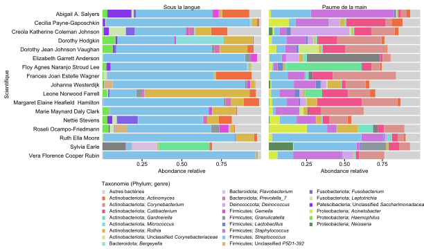
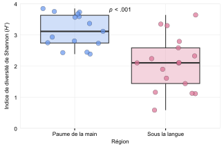
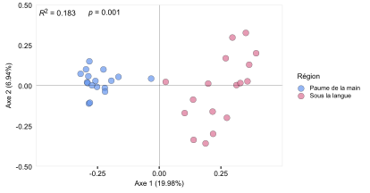

# Statistiques

Importer les libraires que nous devons utiliser 
```{r, eval = FALSE}
library(vegan) # Plusieurs fonctions utiles en écologie 
library(tidyverse) # Manipulation de tableaux de données 
library(forcats) # Pour transformer des variables en facteurs avec un ordre précis "fct_relevel"
library(dplyr) # Manipulation de tableaux de données 
library(tidyr) # Manipulation de tableaux de données 
library(randomcoloR) # Générer palette de couleur 
library(ggplot2) # Graphique 
library(ggtext) # Utiliser le format markdown dans les graphiques (Genre en italique)
library(ggpubr) # Pour combiner des graphiques 
library(export) # Pour enregistrer des graphiques des bonne qualité 
library(reshape2) # Formatter des matrices à partir de tableaux 
library(glue) # Copier-coller du texte ensemble 
```

## Thème pour les graphiques 

Je génère mon propre thème pour les différents graphiques à générer dans lequel je spécifie par exemple la taille du texte, la taille des lignes des axes, etc... 

```{r, eval = FALSE}
text_size = 8
custom_theme = function(){ 
  theme_classic() %+replace% 
    theme(
      #text elements
      plot.title = element_text(size = text_size),                #set font size
      plot.subtitle = element_text(size = text_size),               #font size
      plot.caption = element_text(size = text_size),               #right align
      axis.title = element_text(size = text_size),               #font size
      axis.text = element_text(size = text_size),                #font size
      axis.text.x = element_text(size = text_size),
      axis.text.y = element_text(size = text_size, hjust = 1, margin = margin(r = 0.15, unit = "cm")), 
      axis.line = element_blank(),
      axis.ticks.y = element_blank(), 
      legend.text = element_markdown(size = text_size - 1), 
      legend.title = element_text(size = text_size, hjust = 0), 
      legend.position = "bottom", 
      legend.key.size = unit(0.2, "cm"), 
      strip.text = element_text(size = text_size),
      strip.background = element_blank(),
      panel.border = element_blank(), 
      panel.grid.minor = element_blank(), 
      panel.grid.major = element_blank()
      )
}
```

Importer le tableau de données
```{r, eval=FALSE}
df = readRDS("data/df.Rds")
```


## Abondances relatives des principaux genres 
```{r, eval=FALSE}
# Transformer les valeurs en abondance relative pour chaque des genres pour chaque région 
df_agg = df %>%
  group_by(Sample, Scientifique, Region, Phylum, Genus) %>%
  summarise(Abundance_Genus = sum(Abundance)) %>%
  group_by(Sample) %>%
  mutate(Relative_abundance = Abundance_Genus / sum(Abundance_Genus)) %>%
  mutate(Genus2 = paste("*", Genus, "*", sep = "")) %>%
  mutate(Genus2 = gsub("\\*Unclassified_", "Unclassified *", Genus2)) %>%
  mutate(Taxonomie = paste(Phylum, Genus2, sep = "; ")) 

# Valider que la somme est maintenant de 1 
validate = df_agg %>%
  group_by(Sample) %>%
  summarise(Sum = sum(Relative_abundance))
# All good 

# Identifer les 15 genres qui sont les plus abondant dans la main et sous la langue. 
df_top = df_agg %>% 
  group_by(Region, Taxonomie) %>%
  summarise(mean_relabund = mean(Relative_abundance)) %>%
  slice_max(mean_relabund, n = 15) 

# Générer une palette de couleur 
# custom_colors = distinctColorPalette(k = length(unique(df_top$Taxonomie)))
# color_names = unique(df_top$Taxonomie)
# my_palette = setNames(custom_colors, color_names)
my_palette = readRDS( "data/colors_abondance_relative.Rds")
my_palette[["Autres bactéries"]] = "lightgrey"
#saveRDS(my_palette, "data/colors_abondance_relative.Rds")

top_L = subset(df_top, Region == "Sous la langue") 
top_M = subset(df_top, Region == "Paume de la main") 

df_L = df_agg %>% 
  filter(Region == "Sous la langue") %>%
  mutate(Taxonomie = ifelse(Taxonomie %in% top_L$Taxonomie, Taxonomie, "Autres bactéries")) %>%
  group_by(Region, Scientifique, Taxonomie) %>%
  summarise(Relative_abundance = sum(Relative_abundance )) %>%
  mutate(Taxonomie = fct_relevel(Taxonomie, "Autres bactéries")) 

df_M = df_agg %>% 
  filter(Region == "Paume de la main") %>%
  mutate(Taxonomie = ifelse(Taxonomie %in% top_M$Taxonomie, Taxonomie, "Autres bactéries")) %>%
  group_by(Region, Scientifique, Taxonomie) %>%
  summarise(Relative_abundance = sum(Relative_abundance )) %>%
  mutate(Taxonomie = fct_relevel(Taxonomie, "Autres bactéries"))


# Générer les graphiques 
graph_L = ggplot(df_L, aes(y = Scientifique, x = Relative_abundance, fill = Taxonomie)) + 
  geom_bar(position="stack", stat="identity") +
  xlab("Abondance relative") + 
  ylab("Scientifique") + 
  ggtitle("Sous la langue") +
  custom_theme() +
  theme(legend.position = "none") + 
  scale_fill_manual(values = my_palette) + 
  scale_x_continuous(expand = c(0,0), limits = c(0,1), breaks = c(0.25, 0.50, 0.75)) + 
  scale_y_discrete(expand = c(0,0), limits = rev)

graph_M = ggplot(df_M, aes(y = Scientifique, x = Relative_abundance, fill = Taxonomie)) + 
  geom_bar(position="stack", stat="identity") +
  xlab("Abondance relative") + 
  ggtitle("Paume de la main") +
  custom_theme() + 
  theme(axis.text.y = element_blank(), 
        axis.ticks.y = element_blank(), 
        axis.title.y = element_blank(), 
        legend.position = "none") + 
  scale_fill_manual(values = my_palette) + 
  scale_x_continuous(expand = c(0,0), limits = c(0,1), breaks = c(0.25, 0.50, 0.75)) + 
  scale_y_discrete(expand = c(0,0), limits = rev)

graph_LM = ggarrange(graph_L, graph_M, widths = c(1,0.6))


# Générer le graphique pour la légende 

df_ML = as.data.frame(rbind(df_M, df_L))

df_legend = df_ML %>% 
  mutate(Taxonomie = as.character(Taxonomie)) %>%
  arrange(Taxonomie) %>% 
  mutate(Taxonomie = fct_relevel(Taxonomie, "Autres bactéries"))
  
graph_legende = ggplot(df_legend, aes(y = Scientifique, x = Relative_abundance, fill = Taxonomie)) + 
  geom_bar(position="stack", stat="identity") +
  guides(fill = guide_legend(nrow = 9)) + 
  custom_theme() + 
  scale_fill_manual(values = my_palette, name = "Taxonomie (Phylum; genre)") + 
  theme(legend.title.position = "top", 
        legend.title = element_text(hjust = 0), 
        legend.justification = "left", 
        legend.key.spacing.y = unit(0.1, "cm")) 

gglegend = as_ggplot(get_legend(graph_legende)) 
blank = ggplot() + theme_void()

graph_final = ggarrange(graph_LM, ggarrange(blank, gglegend, ncol = 2, widths = c(0.3, 1)), nrow = 2, heights = c(0.5,0.2))

graph2svg(x = graph_final, file= "data/abondance_relative.svg", font = "Arial", width = 8.5, height = 5, bg = "transparent")
```

```{r echo=FALSE, out.width = "100%", fig.align = "center", out.lenght = "100%"}

```

## Indice de Shannon 

Calculer l'indice de diversité par échantillon 
```{r, eval = FALSE}
# Générer une matrice à partir de notre tableau 
df_abondance = dcast(df, Sample ~ OTU, value.var = "Abundance")
row.names(df_abondance) = df_abondance$Sample
df_asv = df_abondance[-1]
# Calculer l'indice de Shannon
df_shannon = as.data.frame(diversity(df_asv, index = "shannon"))
df_shannon$Sample = row.names(df_shannon)
names(df_shannon)[1] = "Shannon"

meta_data = df %>%
  select(-c(OTU, Type, Abundance, Scientifique, Kingdom, Phylum, Class, Order, Family, Genus)) %>%
  unique()
row.names(meta_data) = meta_data$Sample

df_graphique = merge(df_shannon, meta_data, by = "Sample")
```

Maintenant que nous avons les valeurs de diversité (indice de Shannon) nous aimerions comparer ces valeurs en fonction de la région échantillonnée (langue et main). Pour ce faire, nous pouvons utiliser un test de t de student, mais nous devons avant nous assurer que nos données respectent les postulats de ce test (distribution normale et variance similaire)
```{r, eval = FALSE}
# Est ce que les données ont une distibution gausienne (normale) ? 
valeur_shapiro=list() # créer une liste vide 
# Réaliser le test de shapiro pour chacune des régions 
for (region in unique(df_graphique$Region)){
    sample = subset(df_graphique, Region == region)
    ok = shapiro.test(sample$Shannon)
    valeur_shapiro = append(valeur_shapiro,ok$p.value)
}
data.frame(valeur_shapiro) 
# Pour nos deux régions (langue et main) la distribution des valeurs de Shannon suit une distribution normale 
# (p est supérieur à 0.05)

# Est ce que la variance est similaire ? 
# Nous pouvons facilement tester la variance avec la fonction var.test
var.test(Shannon ~ Region, df_graphique, 
         alternative = "two.sided")

# Comparer la moyenne
t.test(Shannon ~ Region, data = df_graphique)
# t = 4.6192, df = 28.954, p-value = 7.326e-05
``` 
Nos données respectent les postulats du test de t de Student, nous pouvons donc procéder à  l'analyse. 
```{r, eval = FALSE}

graphique_shannon = ggplot(df_graphique, aes(x = Region, y = Shannon, fill = Region)) + 
  custom_theme() +
  theme(panel.border = element_rect(colour = "#E8E8E8", fill = NA, linewidth = 0.5),
        panel.grid.major = element_line(linewidth = 0.25, linetype = 'solid', colour = "#E8E8E8")) + 
  geom_boxplot(alpha = 0.3, outlier.shape = NA) +
  geom_jitter(aes(fill = Region),alpha = 0.7, shape = 21, color = "black", stroke = 0.2, size = 3, ) +
  scale_fill_manual(values = c("cornflowerblue","palevioletred")) + 
  scale_color_manual(values = c("cornflowerblue","palevioletred"))  + 
  labs(x = "Région", y = expression(paste("Indice de diversité de Shannon (", italic("H'"), ")"))) +  
  scale_y_continuous(limits = c(0,4), expand = c(0,0)) +
  annotate(geom ="text", x = 1.5, y = 3.8, label = expression(paste(italic("p")," < .001")), size = 3) + 
  theme(legend.position = "none")

graph2svg(x = graphique_shannon, file= "data/shannon.svg", font = "Arial", width = 4.5, height = 3, bg = "transparent")
```

```{r echo=FALSE, out.width = "100%", fig.align = "center", out.lenght = "100%"}

```

## Ordination (PCoA)

```{r, eval = FALSE}
# Transformer les données d'abondance relative avec l'indice d'Hellinger  
asv_hellinger = decostand(df_asv, method = "hellinger")
# Calculer l'indice de distance de Bray-Curtis entre chaque échantillon 
dist = vegdist(asv_hellinger, method = "bray")
# Générer l'ordination avec la fonction R cmdscale
PCOA = cmdscale(dist, eig=TRUE, add=TRUE) 
# On extrait les coordonnées des points 
position = PCOA$points 
# Changer le nom des colonnes 
colnames(position) = c("Axe.1", "Axe.2") 
# Extraire le pourcentage de variation expliqué par les deux premiers axes 
percent_explained = 100 * PCOA$eig / sum(PCOA$eig) 
# Arrondir 
reduced_percent = format(round(percent_explained[1:2], digits = 2), nsmall = 1, trim = TRUE) 
# Générer des beaux titres pour les axes  
pretty_labs = c(glue("Axe 1 ({reduced_percent[1]}%)"), glue("Axe 2 ({reduced_percent[2]}%)")) 
# Combiner les résultats de la PCOA avec les méta données  
df = merge(position, meta_data, by = 0) 
```

PERMANOVA et betadisper
```{r, eval = FALSE}
# Calculer la dispersion (distance au centroïde)
# S'assurer que les échantillons sont ordonnés dans le même order entre chacun des tabeaux de donnnées 
meta_data = meta_data %>%
  arrange(Sample)
dispr = vegan::betadisper(dist, group = meta_data$Region)
boxplot(dispr, main = "", xlab = "")
# ANOVA sur la dispersion (p = 0.417)
permutest(dispr) 
# ANOVA sur la distance en fonction des région (p = 0.001)
adns = adonis2(dist ~ meta_data$Region)
valR = paste("*R*^2^", round(adns$R2[1],4), sep = " = ")
valP = paste("*p*", adns$`Pr(>F)`[1], sep = " = ")
``` 

Générer le graphique 
```{r, eval = FALSE}
graph_pcoa = ggplot(df, aes(x = Axe.1, y = Axe.2, fill = Region)) + 
  custom_theme() +
  theme(panel.border = element_rect(colour = "#E8E8E8", fill = NA, linewidth = 0.5),
        legend.position = "right") + 
  geom_point(aes(fill = Region),alpha = 0.7, shape = 21, color = "black", stroke = 0.2, size = 3, ) +
  labs(x = pretty_labs[1], y = pretty_labs[2]) + 
  scale_y_continuous(limits = c(-0.50,0.50), expand = c(0,0)) +
  scale_x_continuous(limits = c(-0.5,0.5), expand = c(0,0), breaks = c(-0.25,0,0.25)) + 
  geom_hline(yintercept = 0,linewidth = 0.1) +
  geom_vline(xintercept = 0, linewidth = 0.1) + 
  scale_fill_manual(values = c("cornflowerblue","palevioletred"), name = "Région") + 
  annotate("richtext", x = -0.50, y = 0.45, label = valR, hjust = 0, fill = NA, label.color = NA, size = 3) + 
  annotate("richtext", x = -0.30, y = 0.45, label = valP, hjust = 0, fill = NA, label.color = NA, size = 3) 

graph2svg(x = graph_pcoa, file= "data/PCoA.svg", font = "Arial", width = 5.75, height = 3, bg = "transparent")
``` 

```{r echo=FALSE, out.width = "100%", fig.align = "center", out.lenght = "100%"}

```

